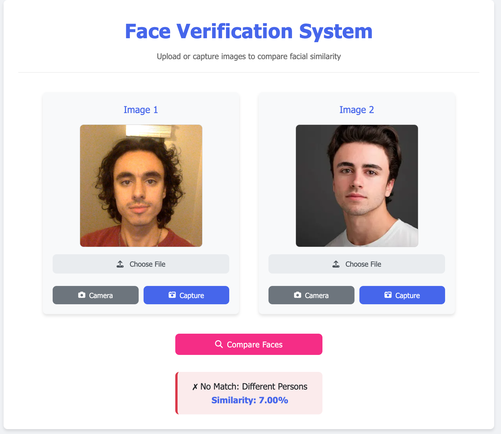
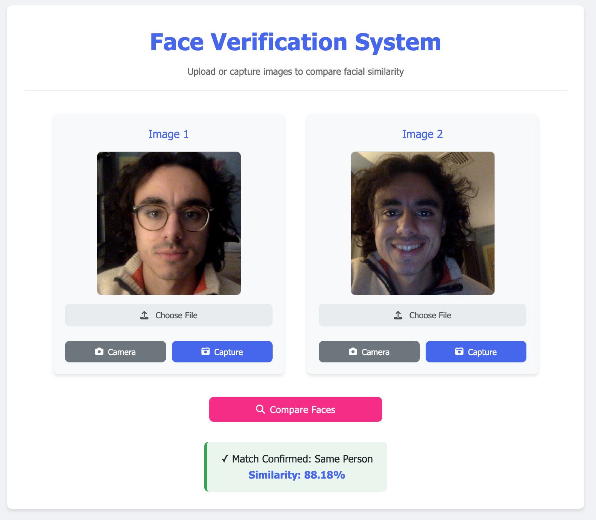

# Facial-Recognition

A personal facial recognition application built with **Flask** and **TensorFlow** that determines if two faces belong to the same person. The system uses a **Siamese Neural Network** trained exclusively on my own face!

## Features

- **Face Detection & Preprocessing**: Automatically detects and crops faces from images
- **Siamese Neural Network**: Deep learning model that measures facial similarity
- **Web Interface**: User-friendly application for comparing faces
- **Real-time Analysis**: Process images from uploads or webcam
- **Privacy-Focused**: Consent required, no images stored permanently

<h2>Demo</h2>

<p align="center">
  
  
</p>

## Project Structure
```
├── flaskapp/                # Flask application folder  
│   ├── app.py               # Flask web application  
│   ├── model.py             # Siamese model architecture  
│   ├── layers.py            # Custom L1 distance layer  
│   ├── preprocess.py        # Face detection and image preprocessing  
│   ├── augment_images.py    # Data augmentation for training  
│   ├── static/              # Static web assets  
│   │   ├── css/  
│   │   │   └── styles.css   # Application styling  
│   │   └── js/  
│   │       └── script.js    # Frontend JavaScript code  
│   └── templates/  
│       └── index.html       # Web interface template  
├── train_model.ipynb        # Model training notebook  
└── siamese_model_final.h5   # Final model weights
```

## Technical Details

### Model Architecture

The face verification system uses a **Siamese Neural Network** with the following components:

#### **Embedding Network**
- **Input**: 100x100x3 RGB images
- **4 Convolutional Blocks** with increasing filter counts (64 → 128 → 128 → 256)
- Each block includes **Conv2D, BatchNormalization, and MaxPooling2D**
- **Dropout (0.3)** for regularization
- Final **Dense layer** with 4096 output features

#### **Siamese Architecture**
- Twin networks with **shared weights** process two input images
- **Custom L1 distance layer** computes element-wise absolute difference
- Final **Dense layer** with sigmoid activation produces a similarity score (0-1)

### Preprocessing Pipeline

- **Face Detection**: MTCNN (Multi-task Cascaded Convolutional Networks) for reliable face detection
- **Standardization**: Crops and resizes faces to **100x100 pixels**
- **Normalization**: Pixel values scaled to **[0,1] range**

### Data Augmentation

The system uses a **comprehensive augmentation strategy** with **9 distinct transformations**:

- **Brightness adjustments** (increase/decrease)
- **Contrast adjustments** (increase/decrease)
- **Horizontal flipping**
- **Saturation adjustments** (increase/decrease)
- **Combined transformations**

### Training

- **Dataset**: Custom dataset of the developer's facial images with **positive and negative pairs**
- **Training Split**: **80% training, 20% testing**
- **Loss Function**: Binary Cross-Entropy
- **Optimizer**: Adam with **learning rate 1e-5**
- **Regularization**: Dropout, Batch Normalization, Gradient Clipping
- **Metrics**: **Accuracy, Precision, Recall, F1 Score**

## File Descriptions

- **`app.py`**: Flask web server that loads the trained model and handles HTTP requests for the web interface. Implements routes for serving the UI and processing verification requests.
- **`model.py`**: Defines the architecture of the Siamese Neural Network, including the embedding network and the final classification layer.
- **`layers.py`**: Contains the custom L1 distance layer that computes the Manhattan distance between embeddings.
- **`preprocess.py`**: Handles face detection, cropping, and standardization using **MTCNN** and includes utilities for format conversion.
- **`augment_images.py`**: Implements **data augmentation techniques** to expand the training dataset and improve model robustness.
- **`train_model.ipynb`**: Jupyter notebook documenting the complete training process from data preparation to evaluation.
- **`static/css/styles.css`**: Defines the **styling** for the web interface, creating a professional and user-friendly appearance.
- **`static/js/script.js`**: Manages the **client-side functionality**, including webcam access, image capture, and API requests.
- **`templates/index.html`**: **HTML template** for the web interface with responsive design and clear user flow.

## Usage

### Launch the application:
```bash
python app.py
```

### Access the web interface:
- Open **http://localhost:5000** in your browser
- Accept the **privacy policy** and **age verification**
- Upload or capture two facial images to compare
- Click **"Compare Faces"** to analyze the similarity between the images

## Requirements

- **TensorFlow 2.12**
- **Flask**
- **OpenCV**
- **NumPy**
- **MTCNN**
- **PIL (Pillow)**

## Model Performance

The model achieves **strong performance metrics** on the test dataset:

- **High precision and recall** for face verification specifically for the developer's face
- **Effective across different lighting conditions and angles**
- **Robust against various image qualities**

**Note**: Performance is optimized for the developer's face only and may not generalize well to other individuals.

## Future Improvements

- Expand the training dataset to include more individuals for **general-purpose use**

